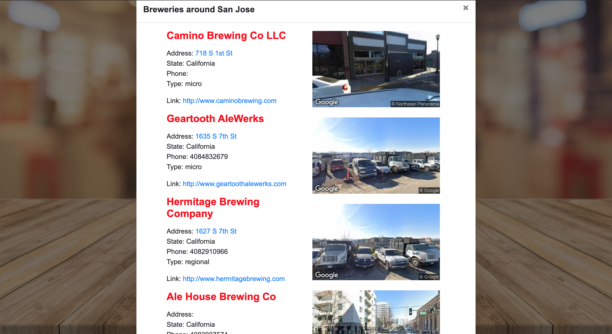

# plenty-of-brew

### Beer Enthusiasts, finally there is an easy way to look for breweries around you!

Application where you look for local breweries around a city. 

Shows result that includes link to their website, their location and contact number for brewery.

You can also see the street view of the brewery for easy find.

You're welcome, enjoy your drink!

## Built with:

HTML 5.0

CSS 3.0

Javascript 1.8.5

JQuery 3.5.1

Bootstrap 4.0

## Contributors:

Blue Ramaila Abad   https://github.com/bibo1011

Dharma Teja Koneru  https://github.com/koneruteja

Daniel Lindsey      https://github.com/DLindsey3415

## Usage:

1. Copy the url - 
  ```bash
  https://koneruteja.github.io/plenty-of-brew/
  ```
2. Paste it in address bar of your browser and hit enter.
3. Enter the name of the city on the searchbox.
4. Hit the pictcher icon.
5. Click link to visit brewery website.

## Website:  https://koneruteja.github.io/plenty-of-brew/ 

## Pre-requisite:

Latest browser {Chrome, Safari, Firefox, Edge}.

Github account to checkout the code.

## Deployment Instructions:

1. Make sure you meet the pre-requisites before continue.
2. To clone the repository use this link: 
  ```bash
  git@github.com:koneruteja/plenty-of-brew.git
  ```
3. Open index.html in your browser.

## Screenshot:


